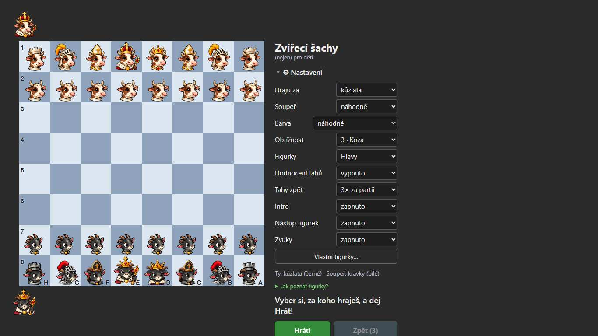

# U1 — UI review and redesign proposal

Status: **proposal, not implemented.** Backlog item U1 (docs/BACKLOG.md). Reviewed against the
live build `b128b2e` (https://zvirecisachy.cz/#bezmereni) and source at `c08a665`, on 2026-09-28.
The main principle is that implementation goes in small steps (see §7), each one checked in the
browser and tried with the owner's son.

## 0. Summary

There is too much on the first screen and nothing tells a first-time user what to do. The
app is feature-rich and the features are good (lessons, puzzles, endings, campaign, friend
game), but each one added a button, a panel or a setting at the same level. The result:

- **36 visible controls** on the main screen: 10 `<select>`s, 9 buttons of equal weight, 2
  disclosures and 14 footer links.
- The **first step is hidden**. On a phone (375×812) "Hrát!" sits at y≈1093, below the fold,
  underneath 10 open settings. On a laptop (1366×768) it is clipped at the fold (y 734–775).
- **Half of the games start "dead".** The default colour is `náhodně`. If the child gets
  black, nothing happens until they find and press "Hrát!", which a non-reader cannot read.
- Panels come in **three different styles**: some modal dialogs, some inline below the still-open
  settings, some with a course map. **"Zpět" means two things**: undo a move, and leave.
- Nothing above the fold tells a parent the site is safe. Social and credit links are one tap
  from the child.

The proposal is **board-first, one clear action, the rest one tap away**:

1. A single action area under or beside the board, whose big button depends on the state
   ("▶ Hrát", or the game controls).
2. Modes as picture tiles.
3. Settings in a sheet with four groups and beginner defaults.
4. One panel template with fixed "◀ Zpět" / "Dál ▶" positions.
5. A small "Pro rodiče" menu for the adult and online things.

No `skm.*` key and no IndexedDB store changes meaning.

## 1. Method and evidence

- **Inventory:** Playwright (playwright-core, installed Edge) against the live site at 375×812
  touch and at 1366×768. It produced a list of the controls, their positions and target sizes,
  plus full-page screenshots of the main screen and all 7 panels.
- **Persona reviews:** three independent persona reviews (Opus), each clicking through the live site.
  - (a) A 6–8-year-old who cannot read yet, on a phone.
  - (b) A 10-year-old club beginner, on a phone and a laptop.
  - (c) A parent on a laptop, checking safety, privacy and simplicity.

  Their key findings are merged into §2. The persona reports and their screenshots stay in the session scratchpad and are not committed. The key evidence (measured px, code lines) is quoted in the findings table.
- **Code check:**
  - `src/main.ts` (template lines 40–133, panel folding lines 994–1035);
  - `src/game-controller.ts` (the pre-game gate: `started`, line 196; the "Hrát!" label, line 1332);
  - `src/ui/*`;
  - `src/styles/*`;
  - `src/db.ts`.
- **Screenshots** (before):
  - `u1/before-desktop-main.jpg`: laptop, first screen.
  - `u1/before-mobile-endgames-full.jpg`: phone, the whole Koncovky page, 1915 px.
  - `u1/before-mobile-lesson.jpg`: phone, lesson 1. The board has scrolled off and five buttons sit under the owl.



## 2. Findings

Severity: **B** blocker (a user cannot proceed), **M** major, **m** minor. The persona column
shows who hit it: a = non-reader, b = 10-year-old, c = parent.

| # | Sev | Who | Screen / element | Evidence | Problem |
|---|-----|-----|------------------|----------|---------|
| F1 | B | a,b,c | Main, "Hrát!" + `Barva: náhodně` | mobile y=1093 in 812 px; desktop y=734–775; `started` gate game-controller.ts:196 | Playing black, the game waits for "Hrát!", which is off-screen and a word. For a non-reader, about half the games never start. |
| F2 | M | a,b,c | Main, "⚙ Nastavení" open by default | 10 selects, 32 px tall (below 44 px), none has a hint; main.ts:53–66 | The first screen is a form. The labels are jargon: "Hodnocení tahů", "Nástup figurek", "Intro", "Tahy zpět". |
| F3 | M | a,b | Main, 7 mode buttons of equal weight | main.ts:100–106; all text only, 43 px | There is no hierarchy and no icons. The adult features (Turnaje, chess.com import in Partie) look the same as Lekce. |
| F4 | M | a,b,c | After "Hrát!" / "Začít" / starting a puzzle on a phone | Page stays scrolled at the buttons: scrollY 458 after "Hrát!", 837 after campaign "Hrát", 234 at lesson start (board cut off, before-mobile-lesson.jpg) | The child is looking at buttons while the owl talks about the board. |
| F5 | M | b | Úlohy / Koncovky / Kamarád inline panels | Inserted between the status line and the button grid; Koncovky starts with 0 moves, so `syncPanels` reopens Nastavení → panel at y≈1093, page 1915 px (Úlohy keeps it closed, panel at y≈650); on the laptop only board rows 1–3 are visible in Koncovky | The panel appears far below the board, and settings stay open above it. |
| F6 | M | a,b | Panel buttons | Lesson: "◀ Zpět", "Dál ▶", "Tohle umím", "Zpět do lekcí", "Zpět do hry"; dialogs use "Zavřít"; undo is "Zpět (3)" | "Zpět" is overloaded: undo vs step back vs leave. The Kamarád panel's cancel "Zpět" (y 1212) sits 47 px above the undo "Zpět (3)" (y 1259); a disabled "Zpět (2)" from the abandoned game stays visible in Úlohy/Koncovky. |
| F7 | M | c | Footer | Privacy text at y≈991 (desktop) / 1330 (mobile), 12.8 px grey; the word "reklam" appears nowhere | The parent's first question ("safe? ads?") is not answered on the first screen. "nic o tobě neukládáme" next to "všechno zůstává v tomhle prohlížeči" reads as a contradiction. |
| F8 | M | a,c | Footer, "Sleduj nás: Facebook · YouTube · Instagram" + 7 credit links | main.ts:114–123; credits open in the same tab | The child is one tap from YouTube or Instagram. Following a credit link and coming back loses the game. |
| F9 | M | c | Kamarád, Turnaje, Partie › Chess.com | Look identical to the offline buttons; friend-panel.ts:129 | Online features are not marked. "Pošli odkaz jen kamarádovi, kterého znáš" appears only after the link exists. |
| F10 | M | b,c | Beginner defaults | Obtížnost 3 = best move at depth 2 (difficulty.ts:31); Hodnocení tahů off; Úlohy default band "lehké (1000–1399)" (puzzles.ts:95) | For a real beginner the first game is lost fast and nobody explains why. |
| F11 | M | c | Reload / leaving the page | Move list is empty after reload; only a `beforeunload` prompt (main.ts:966) | A game in progress is lost. The prompt is unreliable on mobile. |
| F12 | M | a | Reading | No `speechSynthesis`; level 1 has 61 "show" steps and 26 "choose" steps with text answers; the owl, the status, feedback and the confirm bar ("Opravdu…?", at the page bottom) are text only | A non-reader depends on a parent for every lesson step. |
| F13 | m | b,c | Progress | Four separate counters: Lekce "0 z 18", Kampaň "Poraženo 0 z 18", Úlohy "Vyřešeno 0 z 800", Koncovky "Zvládnuto 0 z 81" | There is no overview. Motivation is scattered. |
| F14 | m | b,c | Labels | "Hraju za" vs "Barva" confused; "Figurky: Hlavy / Klasické"; difficulty names change with the animal ("3 · Koza" vs "3 · Žabka") | Hard to tell what a setting does. |
| F15 | m | c | "Vlastní figurky…" | Sends the user to external image generators (user-sets-dialog.ts:117) | This is an adult task, but it sits in the child's settings. |
| F16 | m | all | Visual system | 283 hex literals (80 distinct), no colour tokens; text mostly 0.8–0.85 rem; dark only | The illustrated bright intro clashes with the dark grey app. There is no base for a light theme or bigger kids' type. |
| F18 | M | a | Kamarád, green "Vytvořit odkaz" (112×28) | friend-panel.ts:298; with no game running one tap creates a room and copies the link | One curious tap creates a real online room. |
| F19 | M | a | Lekce course map (dialog) | The only exit is "Zavřít" at the bottom of a ~4400 px list; tapping outside does nothing (course-map.ts:54) | The child is stuck in a long text list. |
| F20 | m | a | Small targets in lessons | "Začít" 51×30, "Tohle umím" 84×28, "Zpět do hry" 88×27 | A stray tap on "Tohle umím" skips a lesson. |
| F21 | m | a | Intro | "Příště bez intra" (115×32) sits right under "HRÁT" (y 760 vs 686–750) | A near miss switches the intro off for good. |
| F22 | m | a | Turn and result | "Na tahu: bílý", the result and "Opravdu vzdát?" are text only; the spectator kings do not highlight | A non-reader cannot tell whose turn it is, or who won. |
| F23 | M | b | Úlohy / Koncovky / Kampaň opened mid-game | `confirmDiscard` only guards Nová hra, lessons and colour change (main.ts:206, 467, 713); the puzzle/endgame handlers (main.ts:308, 387) skip it; after "Zpět do hry" the move count is 0 | One curious tap loses a game in progress. "Zpět do hry" promises the opposite. |
| F24 | M | b | Move quality | "Hodnocení tahů" is off by default; the ?!/? marks show only in the "Tahy" list, which is folded to one 31 px line on mobile; after "Analyzovat partii" there is no summary or legend (the labels exist in `GLYPH_LABEL`, feedback.ts) | "How good were my moves" is the 10-year-old's main question, and it is hard to find. |
| F25 | m | b | Koncovky ladder buttons 1–7 | 30×28 px | Below 44 px. |
| F26 | m | b | Game-over row | "Vzdát" and "Rozbor" take slots in the mode-button grid, so Lekce and Partie move around; "Nová hra" returns to the setup screen, so a rematch takes two taps | The layout shuffles; there is no one-tap rematch. |
| F17 | m | b | Settings fold | Settings collapse only after the first move and reopen on every new game (main.ts:1016–1022) | The panel "jumps"; there is no mute button close to the board after the fold. |

**Works well — keep:**
- Lekce: "Nic není zamčené", "Tohle umím", trainer choice (Sova / own animal), clear levels ("Úroveň 1: Úplný začátečník").
- The blame-free tone ("Nevadí, z chyb se učíme").
- Two-step confirmations ("Opravdu ukončit rozehranou partii?").
- The piece legend ("Jak poznat figurky?").
- soukromi.html: the "Zkráceně" box, 24 h relay deletion, no names, chat or accounts.
- `#bezmereni`, and nothing third-party loads until the user asks.
- The illustrated intro.
- Big board on both widths.

## 3. Information architecture

### 3.1 What lives where

| Level | Content | Why |
|-------|---------|-----|
| **Always visible** (main screen) | Board. One primary action ("▶ Hrát" / game controls). Mode tiles: Lekce, Úlohy, Koncovky, Kampaň, Kamarád. Icon row: 🔊 sound, ⚙ settings, ☰ menu. One trust line. | What a child uses every session. |
| **One tap: ⚙ Nastavení sheet** | Four groups (§5). | Changed rarely; mostly by the parent or the 10-year-old. |
| **One tap: ☰ menu "Pro rodiče a pokročilé"** | Moje partie (saved games + chess.com/PGN import), Turnaje (Lichess broadcasts), Vlastní figurky, Soukromí a bezpečí, Napiš nám, Sleduj nás (FB/YT/IG), O aplikaci a licence. | Adult or online things, and links that leave the site. |
| **Removed from the main screen** | The long privacy paragraph, credits and social links. | They move to the menu, soukromi.html and "O aplikaci". |

The main screen goes from **36 → about 12** visible controls: 1–3 action buttons, 5 tiles,
3 icons, 1 trust link.

### 3.2 First step (Lekce vs Hrát)

The board stays the landing screen, because the product is "play chess with animals". While
lessons are not started (`skm.lessons` empty or absent), the **Lekce tile is the highlighted
first tile**, with the owl's badge "Začni tady". No new screen and no new key. The alternative, a one-off
"Kde začneš?" chooser (two big picture tiles: 🦉 "Naučím se hrát" / ▶ "Umím táhnout, chci
hrát"), is an open question (Q1).

### 3.3 Pre-game fix (F1)

Two changes, each enough on its own; both are recommended:
1. **Default colour `bílá`** for new users only (no `skm.color` stored). Existing users keep their
   stored choice, including `random`.
2. When the human is black, the primary button is the big green **"▶ Hrát"** directly under
   the board, in the first viewport, with a gentle pulse. The owl says (text, later voice):
   „Hraješ za černé. Klepni na zelené tlačítko a soupeř začne.“

## 4. One panel template

Every mode uses the same structure, whether it opens as a picker or runs on the board:

```
┌───────────────────────────────────────┐
│ ◀ Zpět        🧩 Úlohy          3/10 ★ │  header: back (always top-left), icon + title, progress
├───────────────────────────────────────┤
│  body: list of cards / owl bubble      │
│  (picker: lesson levels, puzzle        │
│   themes, ending types, campaign       │
│   animals, friend link)                │
├───────────────────────────────────────┤
│ [ 💡 Nápověda ]            [ Dál ▶ ]   │  footer: secondary left, primary right, 48 px
└───────────────────────────────────────┘
```

- **Picker phase** (choosing a lesson, puzzle band, ending, campaign animal, friend link):
  - Phone (<900 px): a full-screen sheet over the board.
  - Desktop: it replaces the side panel content, with the board still visible.
  - The same component serves the course map, puzzles, endings, campaign and friend. Partie and
    Turnaje use it from the menu.
- **Board phase** (a lesson step, puzzle, ending or campaign game):
  - The action area shows the mode bar: `◀ Zpět | 🧩 Úloha 3 z 10 | Dál ▶`.
  - On a phone the page scrolls the board into view whenever a mode starts (F4).
- **Words are fixed:**

  | Meaning | Label | Replaces |
  |---------|-------|----------|
  | leave the current screen, one level up | **◀ Zpět** (always top-left) | "Zavřít", "Zpět do lekcí", "Zpět do hry" |
  | next step, item or position | **Dál ▶** (always bottom-right, primary colour) | "Další úloha", "Další pozice", "Dál ▶" |
  | take back a move | **↶ Vrátit tah (3)** | "Zpět (3)" |
  | a lesson step back | **◀ Krok zpět** | "◀ Zpět" in the lesson |
  | leave a mode entirely and go to free play | lives only in ◀ Zpět at the top level | "Zpět do hry" |

  "Tohle umím" stays; it goes in the lesson's secondary slot.

## 5. Settings

### 5.1 Grouping and defaults

Selects become segmented buttons, toggles and a picture grid, at least 44 px tall. Stored keys
and values stay the same; only the control changes.

| Group | Setting (proposed label) | Control | Key (unchanged) | Default for new users | Now |
|-------|--------------------------|---------|-----------------|-----------------------|-----|
| **Hra** | Hraju za (Moje zvířátko) | picture grid | `skm.animal` | kůzlata | same |
| | Soupeř | picture grid + 🎲 | `skm.opponent` | 🎲 náhodně | same |
| | Barva | ⚪ bílá · ⚫ černá · 🎲 · 👥 dva hráči | `skm.color` | **bílá** | náhodně |
| | Obtížnost | 1–6 with animal pictures + 7 "pro dospělé" | `skm.difficulty` | **1** (Q5) | 3 |
| **Pomocníci** | Hodnocení tahů („Sova řekne, jestli byl tah dobrý“) | toggle | `skm.moveFeedback` | **zapnuto** (Q5) | vypnuto |
| | Vrátit tah | žádné · 3× · bez omezení | `skm.undoLimit` | 3× (Q5) | same |
| | Sova čte nahlas (new, §6.3) | toggle | new `skm.speak` | zapnuto if a cs voice exists | — |
| **Vzhled** | Figurky (Hlavy / Klasické) | two pictures | `skm.pieceFamily`, `skm.pieceSetId` | Hlavy | same |
| | Úvodní animace | toggle | `skm.intro` | zapnuto | same |
| | Nástup figurek | toggle | `skm.pieceDrop` | zapnuto | same |
| | Vlastní figurky… | → menu "Pro rodiče" | IndexedDB `userSets` | — | in settings |
| **Zvuk** | Zvuky | toggle (also the 🔊 icon by the board) | `skm.sounds` | zapnuto | same |

- Defaults apply **only when the key is absent**. Existing users see no behaviour change.
- The Hra group appears as a **one-line summary chip** on the pre-game screen, e.g.
  „🐐 kůzlata proti 🐄 kravám · ⚪ bílé · úroveň 1 · ✎ Změnit“. The other three groups sit behind ⚙.
- The sheet no longer auto-opens and auto-folds with the move count (main.ts:994–1035). It is
  opened on purpose and closes with ◀ Zpět.
- Changing an in-game setting that needs a new game keeps the existing confirmation.

### 5.2 Label texts (Czech, proposed)

- Group headings: **Hra**, **Pomocníci**, **Vzhled**, **Zvuk**.
- Hints (one line, 0.9 rem):
  - Hodnocení tahů: „Po každém tahu sova řekne, jestli byl dobrý.“
  - Vrátit tah: „Kolikrát smíš vzít tah zpět v jedné partii.“
  - Nástup figurek: „Figurky na začátku nastoupí na šachovnici.“
  - Obtížnost 7: „Pro dospělé a silné hráče.“

## 6. Mobile layout, reading aid, visuals

### 6.1 Wireframes

**Before, phone 375×812** (measured):

```
y=0    ┌─────────────────────┐
       │ opponent avatar     │
  64   │                     │
       │       BOARD         │
       │      351×351        │
 415   │                     │
       │ own avatar          │
 480   │ Zvířecí šachy       │
 530   │ ▼ ⚙ Nastavení       │
 569   │ Hraju za    [▾]     │
       │ Soupeř      [▾]     │
       │ Barva     [▾]       │  ← misaligned
       │ … 7 more selects …  │
 812 ══╪═════ fold ═════════ │
 949   │ [Vlastní figurky…]  │
1025   │ ▶ Jak poznat figurky│
1093   │ [Hrát!] [Zpět (3)]  │  ← primary action, 281 px below the fold
1142   │ [Lekce]  [Partie]   │
       │ [Úlohy]  [Koncovky] │
       │ [Turnaje][Kampaň]   │
1295   │ [   Kamarád       ] │
1330   │ privacy paragraph…  │
1546   │ FB · YT · IG        │
1573   │ 9 credit links      │
1649   └─────────────────────┘
```

**After, phone 375×812** (proposed):

```
y=0    ┌─────────────────────┐
       │🐐 Zvířecí šachy 🔊⚙☰│  44 px top bar
  48   │ opponent avatar     │
       │       BOARD         │
       │      351×351        │
 ~450  │ own avatar          │
 ~500  │ 🐐 vs 🐄 · ⚪ · 1 ✎ │  summary chip (pre-game only)
 ~540  │ [      ▶ HRÁT     ] │  56 px, green, full width
 ~610  │ [🦉 Lekce ★Začni  ] │  tiles 2 per row, 64 px,
       │ [🧩 Úlohy][♔ Konc.] │  icon + one word
       │ [🏆 Kampaň][👫 Kam.]│  👫 carries a small 🌐 badge
 812 ══╪═════ fold ═════════ │
       │ Bez reklam · bez    │  one trust line → Soukromí
       │ registrace ·Soukromí│
 ~900  └─────────────────────┘
```

In a game the chip, "▶ HRÁT" and the tiles are replaced by the game bar:
`[↶ Vrátit tah (3)] [🏳 Vzdát] [＋ Nová hra]` plus the status line. The tiles move below
the move list.

**After, laptop 1366×768:**

```
┌──────────────────────────────────────────────────────────────┐
│ 🐐 Zvířecí šachy (nejen) pro děti              🔊  ⚙  ☰      │
├───────────────────────────────┬──────────────────────────────┤
│                               │ Na tahu: ty (bílé)           │
│            BOARD              │ 🐐 vs 🐄 · ⚪ · úroveň 1 ✎    │
│           560×560             │ [        ▶ HRÁT          ]   │
│                               │ 🦉 Lekce ★  🧩 Úlohy  ♔ Konc. │
│                               │ 🏆 Kampaň   👫 Kamarád 🌐     │
│                               │ ── when a mode is active:    │
│                               │ panel template (§4) here     │
│                               │ Bez reklam · bez registrace ·│
│                               │ Soukromí                     │
└───────────────────────────────┴──────────────────────────────┘
```

Everything above sits inside 768 px. The move list shows in the side panel during a game.

### 6.2 Target sizes and type

- Every tap target is at least 44 px tall; primary buttons are 56 px.
- Body text is at least 1 rem; secondary text is at least 0.875 rem.
- Nothing text-only on the child's path: every tile and primary button gets an icon.

### 6.3 Read-aloud (F12)

- A 🔊 button on the owl bubble and on the status line.
- The first version uses `speechSynthesis` with `lang='cs-CZ'`, and only shows the button if a
  Czech voice is actually listed (`speechSynthesis.getVoices()`).
- Recorded audio for the 18 level-1 lessons is a possible second step (Q4). Which platforms ship a
  Czech voice by default is **unverified**: check it on the son's phone and on iOS before choosing.

### 6.4 Visual system (F16)

1. Introduce CSS custom properties first, with no visible change:
   - colour tokens: `--bg`, `--surface`, `--text`, `--muted`, `--accent`, `--primary`, `--danger`;
   - spacing: `--space-*`;
   - type: `--font-*`;
   - replace the 283 hex literals with them.
2. Then optionally add a warmer, lighter "day" theme that matches the intro's illustration style,
   following `prefers-color-scheme` (Q6). The board colours stay as they are.

## 7. Prioritised change list

Effort: S ≤ 2 h, M ≈ ½–1 day, L ≈ 2–3 days (one developer with Claude, including a browser check).

### Quick wins (no structural change)

| # | Change | Fixes | Effort |
|---|--------|-------|--------|
| 1 | Default `Barva` = bílá when `skm.color` is absent | F1 | S |
| 2 | Move "Hrát!" (and the Lekce button) directly under the board on phone and above the fold on desktop; bigger (56 px), gentle pulse while in pre-game as black | F1, F3 | S–M |
| 3 | Settings start **collapsed** when a stored config exists (returning user); first visit shows the pre-game chip instead of the open form | F2 | S |
| 4 | Scroll the board into view after "Hrát!", lesson start, puzzle and ending start (phone) | F4 | S |
| 5 | Rename undo to „↶ Vrátit tah (3)“; unify leave buttons to „◀ Zpět“ | F6 | S |
| 6 | Trust line under the title: „Zdarma · bez reklam · bez registrace · Soukromí“; add "bez reklam" to soukromi.html | F7 | S |
| 7 | Move FB/YT/IG + credits into a folded „O aplikaci a licence“ `<details>` (later the ☰ menu); open all external links in a new tab | F8 | S |
| 8 | Kamarád panel: „Vytvořit odkaz“ needs a deliberate step (Q7), and show „Odkaz pošli jen kamarádovi, kterého znáš. Bez chatu a bez jmen, jen tahy. Smaže se do 24 hodin.“ **before** creating the link; 🌐 badge on Kamarád/Turnaje | F9 | S |
| 9 | Icons on the 7 mode buttons (🦉 🧩 ♔ 🏆 👫 📜 📡) | F3 | S |
| 10 | Selects and all panel buttons at least 44 px, fix "Barva" alignment; move "Příště bez intra" away from "HRÁT" | F2, F20, F21 | S |
| 10b | Guard Úlohy / Koncovky / Kampaň with the existing `confirmDiscard` when a game is in progress | F23 | S |
| 10c | Hide undo in puzzle/endgame mode; rename the Kamarád cancel to „Zrušit“ | F6 | S |
| 10a | Every dialog gets a sticky „◀ Zpět“ at the top and closes on backdrop tap / Esc (course map first) | F19 | S |

### Medium

| # | Change | Fixes | Effort |
|---|--------|-------|--------|
| 11 | Settings sheet with four groups, toggles and segmented buttons, hints; summary chip | F2, F14 | M–L |
| 12 | ☰ menu "Pro rodiče a pokročilé": Moje partie, Turnaje, Vlastní figurky, Soukromí, Napiš nám, Sleduj nás, O aplikaci | F3, F8, F15 | M |
| 13 | Beginner defaults for new users: level 1, move feedback on, puzzle band "začátečník" (Q5) | F10 | S (code) + owner test |
| 14 | Autosave the game in progress (new key `skm.currentGame`: FEN + moves + settings); offer „Pokračovat v rozehrané partii“ | F11 | M |
| 15 | Read-aloud pilot (speechSynthesis cs-CZ) for the owl and the status | F12 | M |

### Bigger refactors

| # | Change | Fixes | Effort |
|---|--------|-------|--------|
| 15b | Move-quality summary after Rozbor („2 nepřesnosti, 1 chyba“) with a legend from `GLYPH_LABEL`; the move list opens in Rozbor; the mark's label shows while stepping | F24 | M |
| 15c | One-tap „Odveta“ against the computer (same settings; the friend game already has „Odveta“, friend-panel.ts:82); game buttons get their own row, so the mode tiles never move | F26 | S–M |
| 15d | Lessons: where a "choose" step asks for a square or move, let the child tap it on the board instead of reading text answers | F12 | M–L |
| 15a | Picture feedback: the king whose turn it is glows; a big win/lose animal animation over the board at game end | F22 | M |
| 16 | One panel component (§4) for lessons, puzzles, endings, campaign, friend; picker as a sheet on phone and in the side panel on desktop; retire the three current styles | F5, F6 | L |
| 17 | CSS tokens and type scale; then an optional light "day" theme | F16 | M + M |
| 18 | "Můj postup" overview (lessons, campaign, puzzles, endings in one card, with "only in this browser" note) | F13 | M |

Recommended order: 1–10 as one or two small PRs (each tested with the son), then 11 + 12 (the
new main screen), 16, and the rest as they fit.

## 8. Risks and constraints

- **Persistence must not break.**
  - All 20 `skm.*` localStorage keys keep their names and value formats:
    `difficulty`, `moveFeedback`, `undoLimit`, `intro`, `pieceDrop`, `sounds`, `animal`, `opponent`,
    `color`, `pieceFamily`, `pieceSetId`, `lessons`, `campaign`, `puzzles`, `endgames`, `friend`,
    `diplomaName`, `chesscom`, `introShown`, `noAnalytics`.
  - IndexedDB `skm` v2 (stores `userSets`, `games`) is unchanged.
  - New defaults apply only when a key is absent. New keys (`skm.speak`, `skm.currentGame`) are
    additive.
  - Add a regression test that loads a fixture with all keys set and asserts the UI reflects them.
- **Friend game and relay:** no protocol change. The friend panel keeps the same flow; only its
  texts and position change. `#hra=` deep links must still open the friend bar (main.ts:1037).
- **`<dialog>` fallback** (main.ts:135) must keep working for the new sheets.
- **Lesson/puzzle state machines** live in the panel modules. Moving them into one template is a
  view refactor; the tests around lessons, endings and the campaign must pass unchanged.
- **Muscle memory:** the owner's son and the pilot kids know the current layout. Ship the quick
  wins first and watch one real session before the big move.
- **Analytics:** the Cloudflare beacon is unaffected. `#bezmereni` must keep working.
- **Do less:** every new toggle (read-aloud, parent lock) is a new setting. Only add those that
  replace something.

## 9. Open questions for the owner (each with a proposed default)

| # | Question | Proposed default |
|---|----------|------------------|
| Q1 | First visit: land on Lekce or Hrát? | **Hrát (board) with the Lekce tile highlighted „Začni tady“** until the first lesson is done; no extra chooser screen. |
| Q2 | Move Turnaje and chess.com import (Partie) to a „Pro rodiče a pokročilé“ menu? | **Yes.** Saved games go in there too, as „Moje partie“. Revisit if the 10-year-olds miss them. |
| Q3 | Default colour bílá instead of náhodně for new users? | **Yes, bílá**, only when `skm.color` is absent; „🎲 náhodně“ stays as an option. |
| Q4 | Read-aloud for the owl: `speechSynthesis` cs-CZ or recorded audio? | **speechSynthesis pilot first** (behind a 🔊 button, hidden without a Czech voice); record audio only for level-1 lessons if the synthetic voice is poor on the son's phone. |
| Q5 | Beginner defaults for new users: difficulty 1 (now 3), move feedback on (now off), puzzle band „začátečník“ (now „lehké“)? | **Yes to all three**, only for new users. |
| Q6 | Keep dark only, or add a light „day“ theme? | **Tokens first**, then a light theme following the system setting. Dark stays available. |
| Q7 | Parent gate for online features? | **Light gate only on „Vytvořit odkaz“** (Kamarád): a confirm card „Hraješ s kamarádem, kterého znáš? Požádej rodiče, ať mu odkaz pošle.“ with [Ano, vytvořit] / [◀ Zpět]. **No gate** on the ☰ menu or Turnaje (read-only); moving them there and marking them 🌐 is enough. |
| Q8 | Autosave the game in progress? | **Yes** (new key, additive). |
| Q9 | Campaign: lock opponents until the previous one is beaten (now all 18 are open and can be reordered with ▲▼)? | **Keep open** (same idea as "Nic není zamčené" in lessons), but highlight the next unbeaten opponent and dim the beaten ones. |
