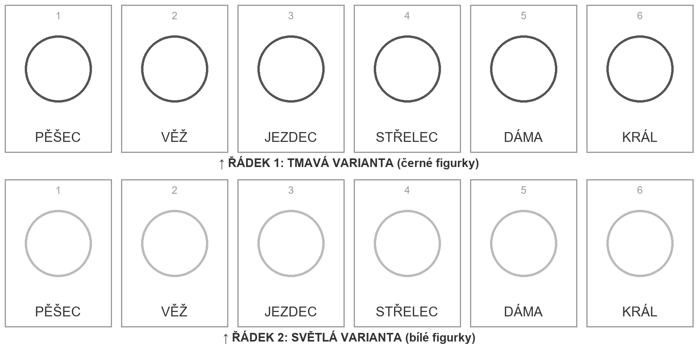

# Vlastní sada figurek (zvíře nebo cokoli jiného)

Každá postava v appce vznikla z **jednoho obrázku**: dvě řady po šesti hlavách. Když
vygeneruješ obrázek ve stejném rozložení, dá se z něj udělat sada stejně jako z těch
původních — a když ho pošleš, přidáme ji do knihovny.

## Rozložení (šablona: [`sada-sablona.png`](sada-sablona.png))



Hotový příklad přesně v tomhle rozložení: [`assets/source/animals/veverky.png`](../assets/source/animals/veverky.png)
(veverky, ChatGPT s DALL·E, prompt níže se `{ZVÍŘE}` = `a squirrel`, `{PALETA}` = `cream and light beige`).
Z něj vzniklo `public/piece-sets/animals/veverky/` bez ruční úpravy.

- **Řádek 1 (nahoře): tmavá varianta** = černé figurky. **Řádek 2 (dole): světlá
  varianta** = bílé figurky. Stejná postava, stejné pózy, jen jiná barva srsti/kůže.
- Zleva doprava v obou řádcích: **pěšec, věž, jezdec, střelec, dáma, král**.
- Jen hlava a ramena („busta“), všechny stejně velké, ze stejného úhlu, s mezerami mezi
  sebou, nic nepřesahuje okraj. Jednobarevné bílé pozadí, bez textu, bez stínů na zemi.
- Role musí být poznat i na 40 px: pěšec bez pokrývky hlavy, věž s kamennou věží na hlavě,
  jezdec s helmou s červeným chocholem, střelec s mitrou s křížem, dáma se zlatou korunou
  s červenými kameny, král s vyšší korunou s křížem **a žezlem**.
- Rozměr kolem 1776 × 888 px (poměr 2 : 1); PNG nebo JPG.

## Prompt (anglicky, generátory to drží spolehlivěji)

Nahraď `{ZVÍŘE}` (např. `a hedgehog`, `a fox`, `a robot`) a `{PALETA}` světlé varianty
(např. `cream and warm orange`). V appce je stejný prompt pod tlačítkem `Vlastní figurky… →
Zkopírovat prompt`. Zvířata, věci, roboti — cokoli; **obličeje skutečných lidí jen s jejich
souhlasem** (u dětí souhlas rodičů) — sada s kolegy z práce je fajn nápad, ale každý z nich
musí říct ano.

```
A character sheet for a children's chess set: TWO horizontal rows of six busts of {ZVÍŘE} on a plain, uniform white background, all twelve the same size, the same viewing angle, evenly spaced, nothing overlapping, nothing cut off at the edges, head-and-shoulders only.
Both rows, left to right: PAWN, ROOK, KNIGHT, BISHOP, QUEEN, KING. Each bust is the same character wearing the piece's traditional marker so the role is unmistakable even when small: the pawn has a plain collar and no headgear; the rook wears a grey stone castle tower as a hat; the knight wears a medieval helmet with a red plume; the bishop wears a tall bishop's mitre with a cross; the queen wears a golden crown with red jewels; the king wears a taller golden crown topped with a cross AND holds a golden sceptre.
TOP ROW = DARK VARIANT: the character's fur/skin in dark tones (charcoal, deep brown or dark grey). BOTTOM ROW = LIGHT VARIANT: the very same six busts, same poses and markers, fur/skin in {PALETA} (light, pale tones) with small warm accents.
Style: cute cartoon, bold dark outlines, soft cel shading, friendly faces. No text, no letters, no labels, no watermarks, no frame, no ground shadows, no extra objects.
```

Prompt je záměrně celý — generátor si minulé zadání nepamatuje, každá úprava („jen změň
barvu“) musí znovu obsahovat všechno.

## Co dál

1. **Poslat nám ji** (formulář zpětné vazby v patičce appky nebo issue na GitHubu) — ideální
   cesta: sadu vyřízne skript `scripts/extract-animals.py`, postava dostane jméno, zvuk a
   názvy úrovní v `public/piece-sets/animals/animals.json` a objeví se v knihovně pro všechny.
2. **Použít ji jen u sebe:** v appce `Vlastní figurky…` → nahrát jednotlivé soubory
   (`wK wQ wR wB wN wP bK bQ bR bB bN bP`). Rozřezat obrázek na dvanáct souborů zatím musíš
   sám (ořez v libovolném editoru; PNG s průhledným nebo jednobarevným pozadím). Taková
   sada zůstává jen ve tvém prohlížeči.

## Pro vývojáře: přidání do knihovny

```powershell
pip install -r scripts/requirements.txt
```
```powershell
python scripts/extract-animals.py <id>
```
Obrázek patří do `assets/source/animals/<id>.png`, `<id>` je malé ASCII bez diakritiky
(`jezci`). Skript vyřízne 12 PNG 256 × 256 do `public/piece-sets/animals/<id>/` a napíše
`pieces.css`; bez argumentu přegeneruje všechno včetně kontaktních archů
`docs/piece-contact-sheet-animals-*.png` (kontrola čitelnosti na 40 px). Pak přidej záznam do
`animals.json` (`id`, `name`, `za` = 4. pád, `sound`, `hurt`, šest `levels`) a do
`DEFAULT_ORDER` v `src/campaign.ts` (pořadí v kampani). Listy s českými popisky mezi
řádky (původní sady) i bez nich (od veverek) skript zvládne.
